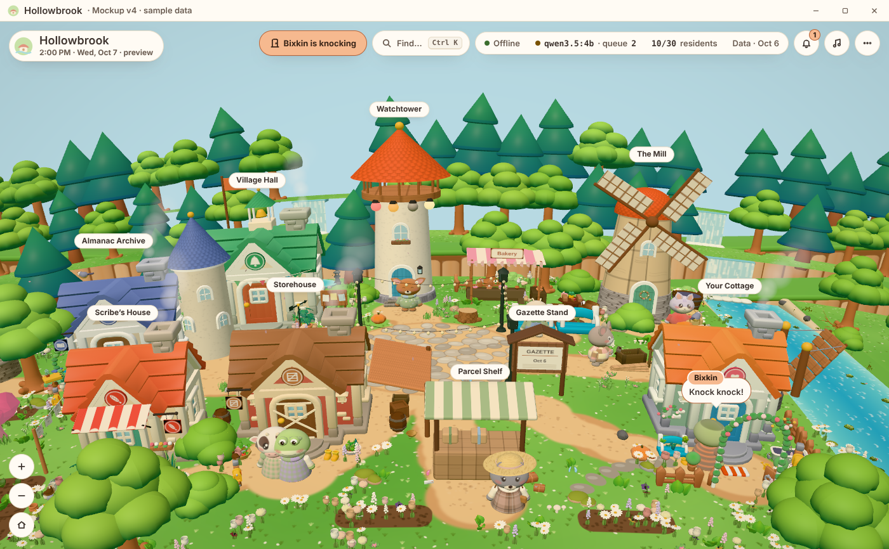
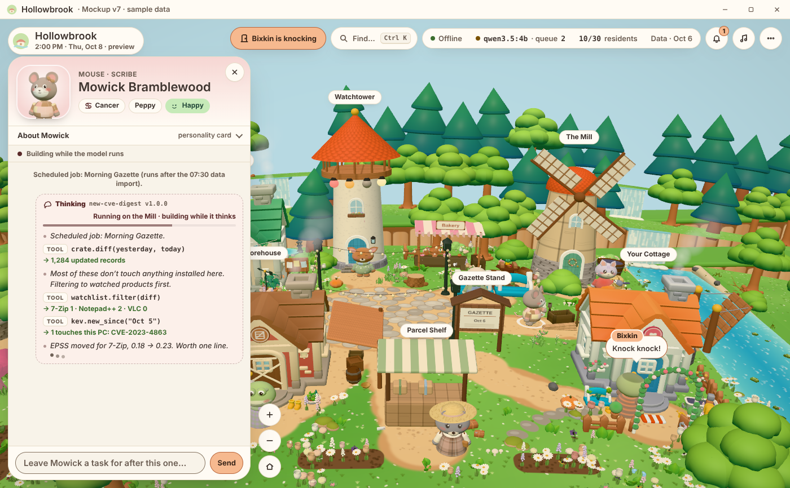
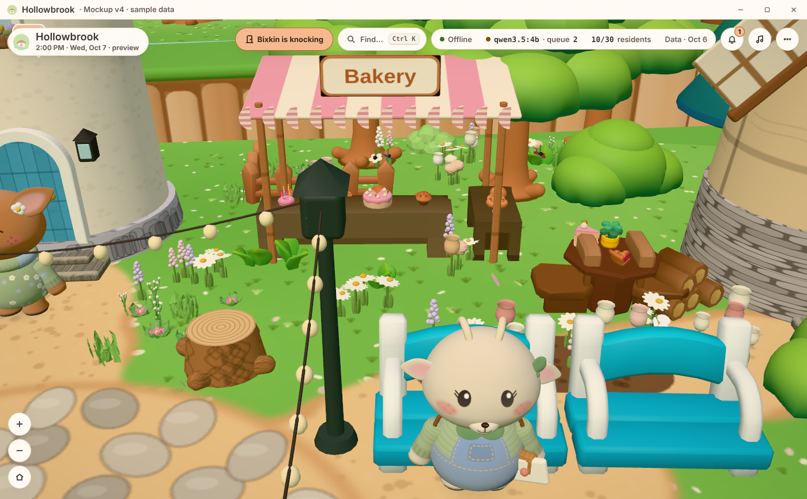
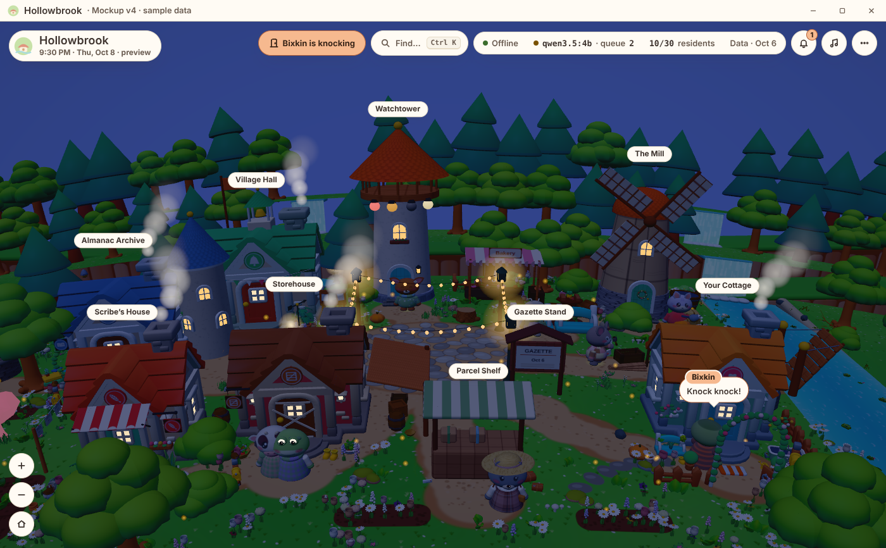

# Hollowbrook

A cozy cottagecore village where AI agents live as original animal villagers and do real work
(data aggregation, CVE lookups, "am I affected?" checks) on local models. This repo holds the
**interactive mockup (v7)**. The real desktop app is built after the plan is approved.

## Run it (works fully offline)

Everything the mockup needs is in this repo, including the 3D library (three.js r182) and fonts in
`mockup/vendor/`, so it runs on an air-gapped machine with no internet at all.

**You need:** a modern browser with WebGL 2 (Chrome, Edge, Firefox or Safari from the last few years)
and Python 3 to serve the folder locally. Python is only a tiny file server; nothing is installed.

- **Windows:** double-click `Start-Hollowbrook.cmd`.
- **Linux / macOS:** run `./start-hollowbrook.sh`.
- **By hand:** `cd mockup` then `python3 -m http.server 8765 --bind 127.0.0.1`, and open
  `http://localhost:8765/` in the browser. Press Ctrl+C in the terminal to stop.
- **No Python?** Any static file server pointed at `mockup/` works, for example
  `php -S 127.0.0.1:8765`, `ruby -run -e httpd . -p 8765` or `busybox httpd -f -p 8765`.

To move it to a closed machine, copy `dist/hollowbrook-mockup-v7.zip` (or the whole repo) over on a USB
stick, unzip it anywhere, and start it as above. The server only listens on this machine
(`127.0.0.1`), and the page never contacts the internet. Opening `index.html` straight from disk
(double-clicking it) won't work, because browsers block it from loading the model packs; that's why a
local server is needed. Settings and your village roll are kept in the browser's local storage.

All data shown is sample data.

## What's in v7

- Click any villager to open a chat: live "thinking" (plan, tool calls, checks) while they work, or an
  empty chat you can task when they're free. Tasks use that villager's own skill; busy villagers queue them.
- Personality card per villager: front portrait, zodiac, trait, likes and dislikes, favourite spot, job
  description, and a mood meter driven by how much you've been asking of them (bored ↔ frazzled).
- Village built from free design kits (Tiny Treats, Pond Kit, Japan Village props, Nature Asset,
  cute plants, woven basket): bakery stall, produce stand, yard dioramas, gateway with stone lanterns,
  plum trees, river life. Credits in `CREDITS.csv`.
- Map-first desktop UI: wheel zoom, drag/turn, Ctrl+K, shortcuts (`?`), settings, inbox, three music
  tracks with separate music / effects / ambient volumes, real sunrise and sunset for US Eastern time.

| | |
|---|---|
|  |  |
|  | |

Villagers and buildings are original designs (no characters from any game).
